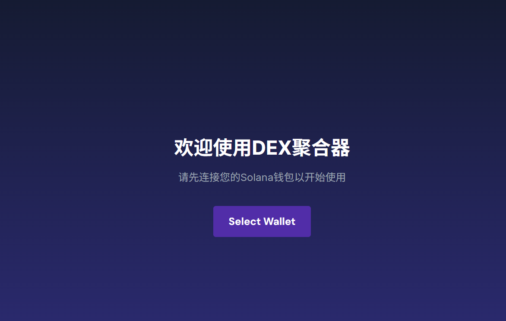
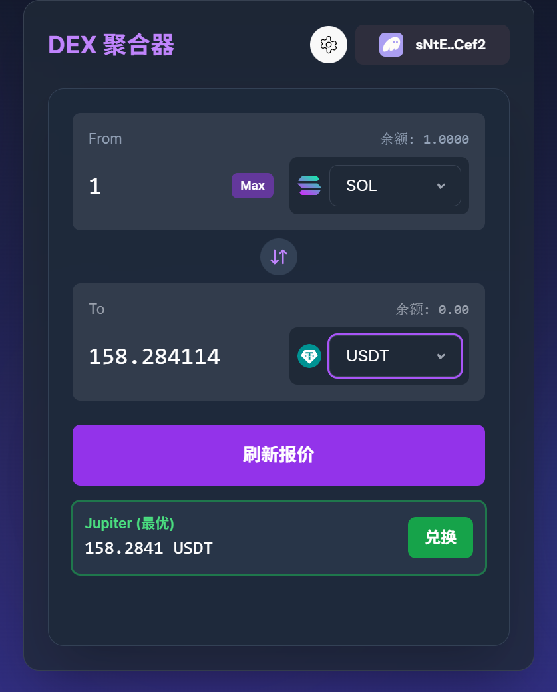
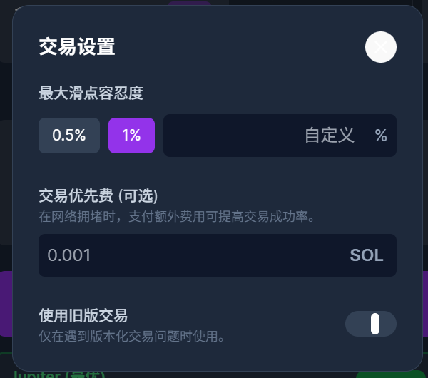

---

# 🌉 Solana DEX 聚合器（solana-dex-aggregator）

一个构建于 **Solana Devnet** 的去中心化交易所（DEX）聚合器，集成 Jupiter、Raydium 等主流协议，提供智能路由、链上限价单、DCA 策略、链上路由分析、历史记录与多语言支持，致力于打造近商业级的极致交易体验。

---

## 🚀 在线演示（Live Demo）

🔗 [点击访问vercel在线应用](https://solana-dex-aggregator-kpit95iie-aiangks-projects.vercel.app/)


---

## ✨ 核心功能（Key Features）

### ⚡ 智能聚合路由

* 集成 Jupiter Aggregator，自动寻找最优路径与报价
* 支持 Raydium 直连报价与兑换
* 路由详情可视化展示

### 🔗 钱包集成

* 支持 Phantom、Solflare 等主流钱包
* 实现流畅的连接、签名与交易流程

### ⚙️ 专业交易设置

* **自定义滑点容忍度**：预设选项（0.5%、1%）+ 自定义输入，超高滑点实时预警
* **交易优先费用**：自定义小费（单位：SOL），支持美元换算
* **交易版本控制**：支持新版与旧版交易接口切换

### 📈 实时数据反馈

* **钱包余额展示**：链上查询用户代币余额并实时更新
* **价格影响预估**：概念性实现大额交易对价格影响的提示

### 💎 极致用户体验（UX）

* 非阻塞式通知：基于 `react-hot-toast` 的交易进度提示
* 响应式现代 UI：基于 Tailwind CSS，适配移动端与桌面端
* 输入校验与提示：金额校验 + 超额输入警告
* 一键最大金额：支持 “Max” 按钮快速填充可用余额

### 📝 策略与历史
限价单：链上创建/取消，实时同步
DCA 策略：本地定投计划，支持多频率
历史记录：本地保存，支持一键复用与 Solscan 跳转

### 🔗 链上功能区
可视化展示链上缓存的最佳路由与流动性池
多币种对支持，详细路由步骤一览

### 🌍 多语言支持
全局中英文切换，所有页面即时响应

---

## 🛠️ 技术栈（Tech Stack）

### 📦 前端与语言

* **React.js + Vite**（构建工具）
* **TypeScript**（类型安全）

### 🔌 协议与 SDK

* `@jup-ag/react-hook`：Jupiter 聚合器接入
* `@solana/web3.js`：与 Solana 区块链交互
* `@solana/wallet-adapter`：钱包集成适配器
* `@raydium-io/raydium-sdk`: raydium SDK接入

### 🎨 UI 与交互

* **Tailwind CSS**：现代响应式设计
* **Lucide React**：图标库
* **react-hot-toast**：通知系统
* **bignumber.js**：高精度计算库

### 🧠 状态管理

* React Hooks：`useState`, `useMemo`, `useCallback`, `useEffect`
* 自定义 Hooks：封装业务逻辑

### 🚀 部署平台

* **Vercel**

---

## 🧠 核心概念学习与应用（Core Concepts）

此项目不仅是 DEX 聚合器，更是深入理解 Web3 技术的平台：

* **Solana 程序交互**：支持链上 PDA 路由缓存读取与 Anchor 交互
* **异步编程与副作用管理**：全局 useEffect/useCallback 组合
* **Solana 账户模型**：理解主账户与 ATA（关联代币账户）的差异
* **交易生命周期管理**：从构建、签名、发送到确认的完整流程
* **组件化架构设计**：逻辑与 UI 解耦，易于维护和扩展
* **Vite 环境兼容性处理**：如 Buffer polyfill 等工程化技巧

---

## ⚙️ 本地开发与运行

```bash
# 克隆仓库
git clone https://github.com/your-username/solana-dex-aggregator.git
cd solana-dex-aggregator

# 安装依赖
npm install

# 启动开发服务器
npm run dev
```

打开浏览器访问：`http://localhost:5173`

---

## 📸 项目截图（Screenshots）

### 钱包连接



### 首页（Swap）


### 链上功能区


### 历史记录


### 限价单与DCA策略


---

## 🚀 未来计划（Future Improvements）

* 📊 **价格图表支持**：引入 K 线图组件展示代币走势
---

> 免责声明：本项目仅供学习和技术交流，涉及链上操作请注意资金安全。
## 🔼 [返回顶部](#solana-dex-聚合器solana-dex-aggregator)

---

